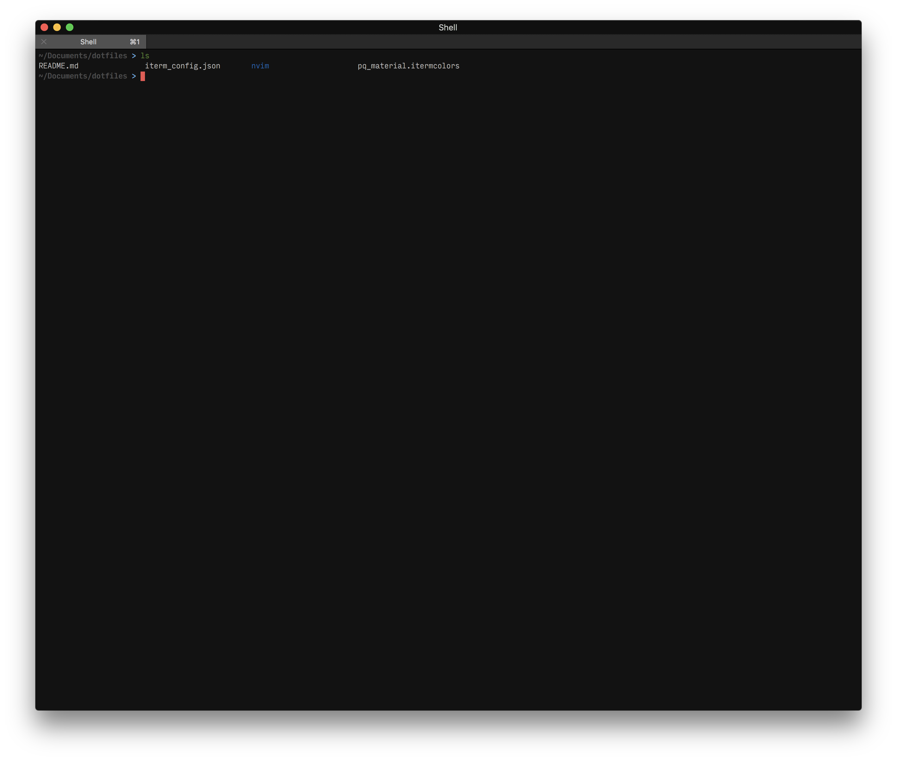

# dotfiles
My very own config files, built from scratch just for fun. 🚀

I love Unix and KISS. I very much don't like bulky terminals, editors, shells
and config files. So I take the time to build my own setup, slowly and simply.
This is my current config, I use iTerm, zsh and neovim. And created my own color
palette and my own theme for neovim and the terminal, inspired by Material
design. My text editor of choice is Neovim. But I do use and IDE, its name is
UNIX. 😉

A very simple shell, yet effective, I killed the whites so that my eyes survive:

And the best text editor on mother Earth, probably in the solar system, Neovim:

You can even use Vim for text, markdown and latex, you just need to enable line
wrapping.
